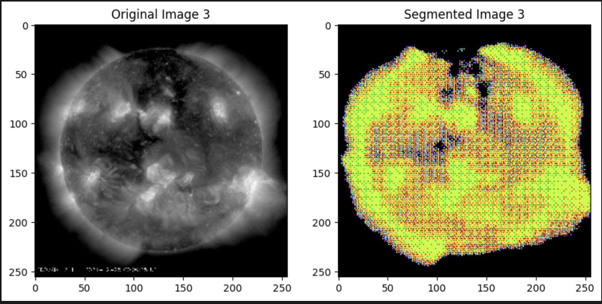
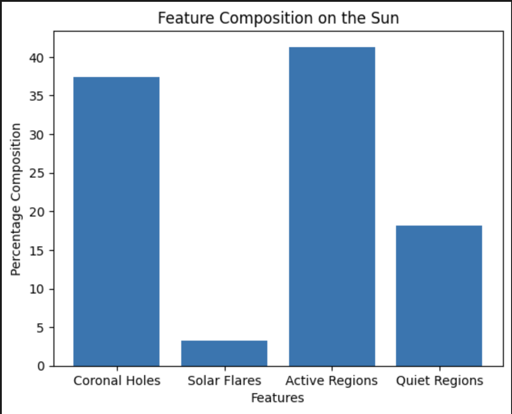
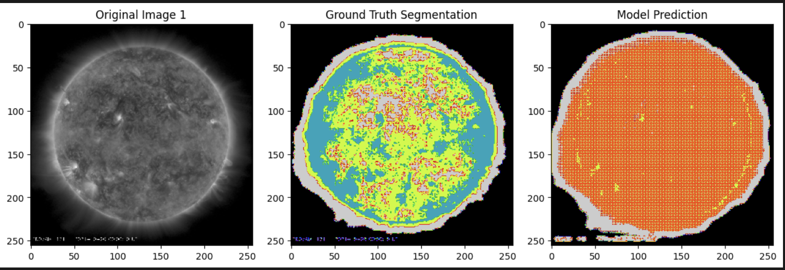
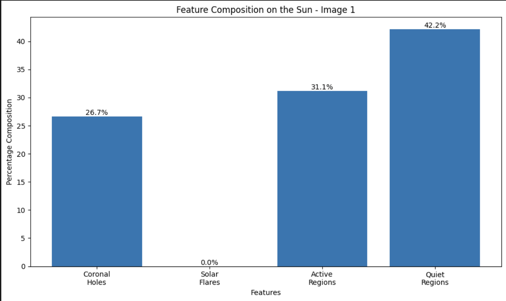
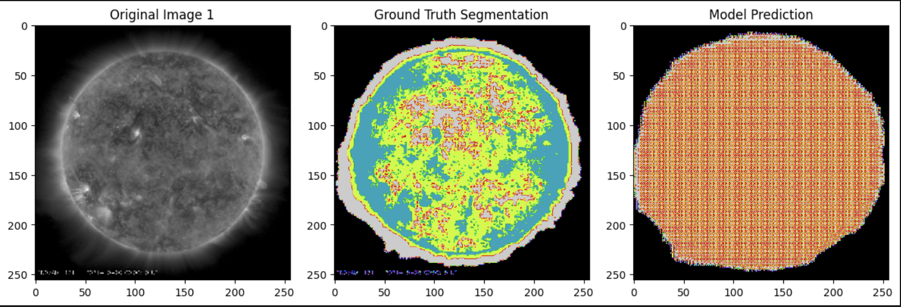
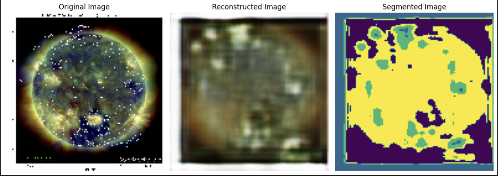
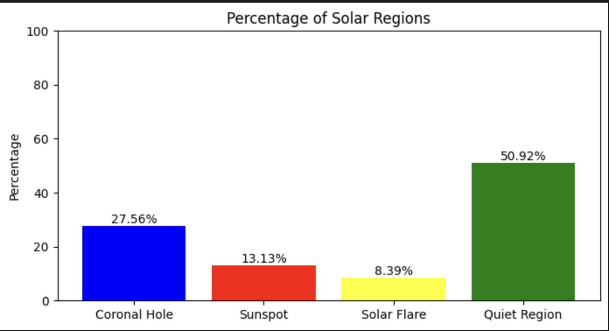
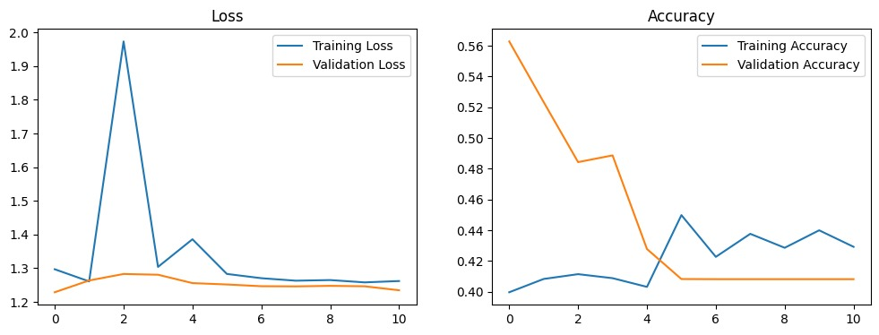

# Solar Image Segmentation Using Deep Learning


## Project Overview

This project leverages deep learning to automatically segment solar images, identifying key solar features such as sunspots, solar flares, coronal holes, and quiet regions. The goal is to accelerate solar event analysis, aiding space weather prediction and scientific research.

---

## Key Features
- **Automatic Segmentation:** Detects and segments sunspots, solar flares, coronal holes, and quiet regions from high-resolution solar images.
- **Multiple Approaches:** Includes supervised (U-Net) and unsupervised (Autoencoder + K-means) segmentation methods.
- **Comprehensive Analysis:** Provides both visual and quantitative analysis of solar features.
- **Flexible & Reproducible:** Modular notebooks for easy experimentation and extension.

### Scientific Background
- **Solar Flare:** Sudden, intense burst of radiation from the Sun’s surface, often associated with sunspots and active regions. Can disrupt communications and power systems on Earth.
- **Coronal Hole:** Dark, cooler regions in the Sun’s corona with open magnetic field lines. Sources of high-speed solar wind streams.
- **Sunspot:** Dark, cooler areas on the Sun’s photosphere caused by magnetic activity. Often the sites of solar flares.
- **Quiet Region:** Areas of the Sun with relatively low magnetic activity, appearing less bright and less structured compared to active regions.

---

## Dataset
- **Source:** High-resolution solar images from NASA’s Solar Dynamics Observatory (SDO).
- **Annotations:** Images are manually annotated with segmentation masks for sunspots, solar flares, coronal holes, and quiet regions.
- **Augmentation:** Data is augmented with flips, rotations, and zooming to enhance training.

**Directory Structure:**
```text
project-root/
├── dataset/
│   ├── Solar_images_final/   # Raw solar images (e.g., .png)
│   └── masks/               # Segmentation masks (generated or provided)
├── images/                  # Output and visualization images
├── Image_Segmentation_1.ipynb
├── image_Segmentation.ipynb
├── Image_Segmentation_FINAL.ipynb
├── Image_Segmentation_Autoencoder.ipynb
└── README.md
```

**Sample Images:**
- 
- 

---

## Approaches & Notebooks

### 1. Image_Segmentation_1.ipynb
- **Approach:**
  - U-Net convolutional neural network for multi-class segmentation (coronal holes, solar flares, active regions, quiet regions).
  - Moderate data augmentation and detailed post-processing.
- **Output:**
   
   
- **Uniqueness:**
  - Balanced augmentation for generalization.
  - Simultaneous segmentation of four solar features.
  - Quantitative feature composition analysis.

### 2. image_Segmentation.ipynb
- **Approach:**
  - U-Net with more aggressive data augmentation and different optimizer settings.
- **Output:**
  
  

- **Uniqueness:**
  - Serves as a baseline with aggressive augmentation for comparison.

### 3. Image_Segmentation_FINAL.ipynb
- **Approach:**
  - U-Net, best-tuned for final results, with optimal augmentation and hyperparameters.
- **Output:**
  
  
- **Uniqueness:**
  - Represents the best-performing, final version for supervised segmentation.

### 4. Image_Segmentation_Autoencoder.ipynb
- **Approach:**
  - Autoencoder for unsupervised feature extraction, followed by K-means clustering for segmentation.
- **Output:**
  
  
- **Uniqueness:**
  - Integrates deep learning and classical machine learning.
  - Useful for unsupervised segmentation or when labeled data is scarce.

---

## How to Run

1. **Clone the Repository**
   ```bash
   git clone https://github.com/your-username/solar-image-segmentation.git
   cd solar-image-segmentation
   ```
2. **Install Dependencies**
   ```bash
   pip install tensorflow keras opencv-python numpy matplotlib scikit-learn
   ```
3. **Prepare the Dataset**
   - Place raw solar images in `dataset/Solar_images_final/`.
   - If masks are not provided, they will be generated by the notebooks.
4. **Run the Notebooks**
   - Open any notebook in Jupyter or VSCode and run all cells.
   - Adjust paths as needed for your system.

   

---

## Future Work
- Expand the dataset to include real-time solar images for better performance.
- Experiment with advanced architectures like U-Net++ or Vision Transformers.
- Deploy a real-time segmentation system for continuous monitoring of solar events.

---

## Contributing
We welcome contributions! Fork the repository, make your changes, and submit a pull request to help advance solar image segmentation.

---

## Contact
Feel free to reach out if you have any questions, ideas, or would like to discuss solar activity.
- Email: dhyanms@gmail.com & kashishvarmaa@gmail.com
- GitHub: [Dhyanms](https://github.com/Dhyanms) & [Kashishvarmaa](https://github.com/Kashishvarmaa)