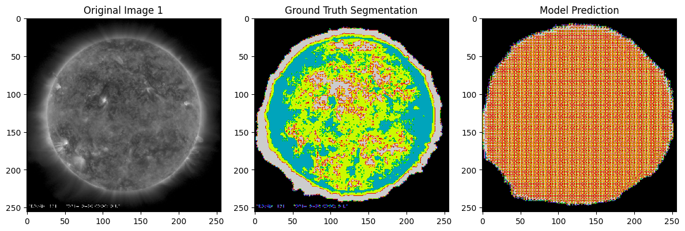
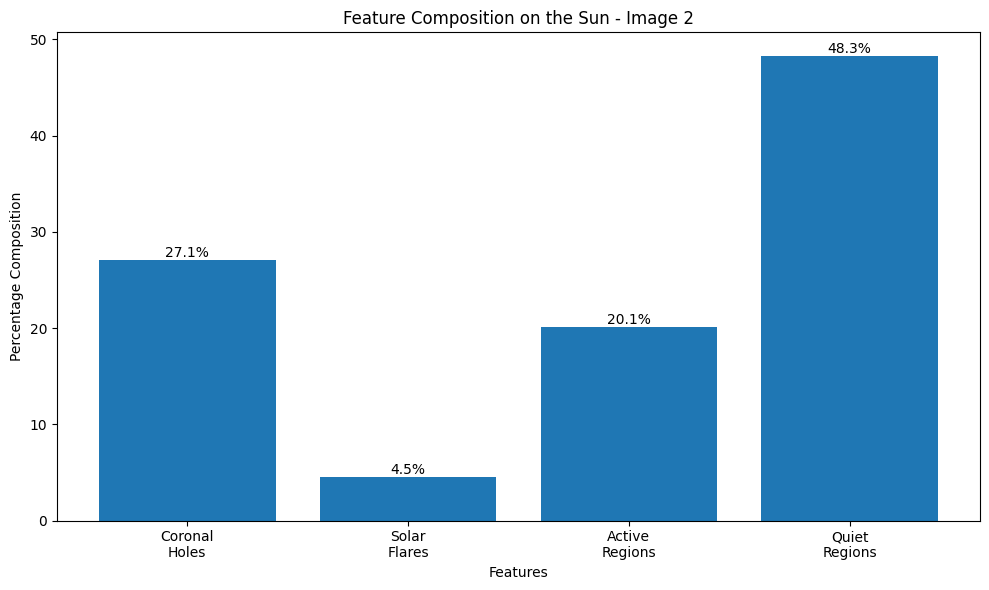

# Solar Image Segmentation Using Deep Learning

## Project Overview
- Uses deep learning to automatically segment solar images.  
- Detects key solar features: sunspots, solar flares, and other phenomena.  
- Utilizes high-resolution images from NASA’s Solar Dynamics Observatory (SDO).  
- Aims to accelerate solar event analysis, aiding space weather prediction and scientific research.

---

## Technologies Used
- **Frameworks:** TensorFlow, Keras  
- **Programming Language:** Python  
- **Libraries:**  
  - OpenCV (image processing)  
  - NumPy (numerical operations)  
  - Matplotlib (visualization)  

---

## Dataset
- Custom dataset of 400 high-resolution solar images from NASA’s SDO.  
- Images manually annotated with segmentation masks for sunspots and solar flares.  
- Data augmented with flips, rotations, and zooming to enhance training.

---

## Model Architecture
- Autoencoder neural network with encoder-decoder structure.  
- Encoder compresses images into a latent representation.  
- Decoder reconstructs segmented images preserving spatial features.  
- Architecture designed for precise segmentation with minimal information loss.

---

## Training & Evaluation
- Trained using Binary Cross-Entropy loss.  
- Evaluated with Dice Coefficient to measure segmentation accuracy.  
- Achieved high accuracy in detecting key solar features.

---

## Steps to Run the Project

### 1. Clone the Repository
```bash
git clone https://github.com/your-username/solar-image-segmentation.git
cd solar-image-segmentation
```

### 2. Install Dependencies
```bash
pip install -r requirements.txt
```

### 3. Run the files

---

## Results
The model accurately segments sunspots and solar flares, creating clear and useful boundaries. This segmentation provides valuable insights for studying solar activity and enhances our understanding of space weather.

Here are some example outputs:

### Segmentation Output


### Feature Composition


### Training Performance


---

## Future Directions
- Expand the dataset to include real-time solar images for better performance.  
- Experiment with more advanced architectures like U-Net++ or Vision Transformers for improved segmentation accuracy.  
- Deploy a real-time segmentation system for continuous monitoring of solar events.

---

## Contributing
We welcome contributions to improve this project. Fork the repository, make your changes, and submit a pull request to help advance solar image segmentation.

---

## Contact
Feel free to reach out if you have any questions, ideas, or would like to discuss solar activity.  
- Email: dhyanms@gmail.com & kashishvarmaa@gmail.com  
- GitHub: [Dhyanms](https://github.com/Dhyanms) & [Kashishvarmaa](https://github.com/Kashishvarmaa)